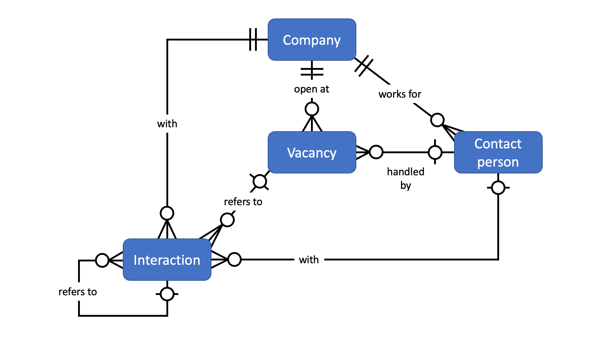

# Design Document

By Marten Dreger

Video overview: <https://youtu.be/i7N2sCi5ZJI>

## Scope

The purpose of this database is to help people who are currently in the process of applying for a new job with keeping track of all related data such as:

* Companies, meaning potential employers and their basic information
* Vacancies, meaning specific open positions at these companies, including basic information
* Contact persons, who are working at these companies and are involved in the hiring process somehow
* Interactions, refering to all emails, phone calls, etc. made to any of the companies

The database only includes information about the outgoing nature of an application. This means that all internal data, such as competencies, past experience, education, certificates, resume, etc. of the applicant themselves is not in scope. Also not in scope are specific application tactics or preparations that might be different depending on the companies.

## Functional Requirements

This database supports:

* CRUD operations for companies, vacancies and contact persons
* Link potentially interesting vacancies with a company and contact persons (if applicable)
* Keeping track of all interactions (of which there can be multiple) between the applicant and any company.

So far the database does not support any direct links related files via file path or the file itself. Instead, the files (e.g. job posting or email history) will be stored on hard drive and named according to the ID in question (e.g. vacancy id or interaction id).

## Representation

### Entities

The entities in this database are described as follows:

#### Companies

The `companies` table includes:

* `id`, which is the `PRIMARY KEY` and represented as an `INTEGER`.
* `name`, which is the company name represented as `TEXT` with the constraint `NOT NULL`.
* `website`, which is the company website URL as `TEXT`, with no constraints, as some companies might not have a website.
* `hq_country`, which is the country where the company's headquarter is located as `TEXT` with the constraint `NOT NULL`. The reason to include this is that it gives an indicator about the company culture and prevailing language, which is important for international applications.
* `industry`, describing the main industry of the company (could be multiple), represented as `TEXT` with the constraint of `NOT NULL`.
* `employee_count`, which is the number of employees represented as `INTEGER` and with no constraints, as it could be unknown. It gives a rough indicator about the company size.
* `revenue`, which means annual revenue of the company, represented as `TEXT` with no constraints, as it could be unknown. It is another indicator about the company size. Note that `TEXT` is used here because the revenue could come in different currencies and timeframes. I don't care about filtering or searching for this field, so it does not need to be in numeric format.
* `comment`, which can be any type of personal comment, e.g. about the impression that the company makes on the applicant and whether he/ she thinks they would be a good fit. Represented as `TEXT` with no constraints.

#### Contact persons

The `contact_persons` table includes:

* `id`, which is the `PRIMARY KEY` and represented as an `INTEGER`.
* `company_id`, which is a `FOREIGN KEY` to the `id` column in the `companies` table, represented as `INTEGER`.
* `family_name`, which is the person's family name represented as `TEXT`, with constraint `NOT NULL`.
* `given_name`, which is the person's given name(s) represented as `TEXT`, with no constraints, as it might be unknown.
* `title`, represented as `TEXT`, and might either simply be Mr./Ms. or some academic title. It has the `NOT NULL` constraint, as it should always be known in practice and is important for interactions with this person.
* `job_title`, referring to the person's function in the company, represented as `TEXT` and without constraints, as it might be unknown.
* `linkedin`, which is the person's linkedin profile as `TEXT`, with no constraints, as they might not have one.
* `comment`, which can be any type of personal comment, e.g. about how the applicant first met this person or what some personal relation between them might be. Represented as `TEXT` with no constraints.

#### Vacancies

The `vacancies` table includes:

* `id`, which is the `PRIMARY KEY` and represented as an `INTEGER`.
* `company_id`, which is a `FOREIGN KEY` to the `id` column in the `companies` table, represented as `INTEGER`.
* `contact_person_id`, which is a `FOREIGN KEY` to the `id` column in the `contact_persons` table, represented as `INTEGER`.
* `job_title`, which is the name of the open job position, represented as `TEXT` and with constraint `NOT NULL`.
* `application_deadline`, which is a date that is ideally in format YYYY-MM-DD and marks the last day of possible application for this vacancy. No constraints, as it might be unknown.
* `location`, which is where the job is located, represented as `TEXT` with constraint `NOT NULL`. Note that it does not have to refer to a physical location, it could also e.g. be "remote".
* `salary`, which is the associated salary represented as `TEXT`. I am not using `NUMERIC` here, because the salary might be given in different currencies, and/ or over different timeframes (monthly, yearly), with or without bonus, etc.. Also, depending on which country the job is in, different taxes will apply, so the net salary would change. There is no constraint for this field, as salary information might be unknown prior to an interview.
* `conditions`, which refer to details such as working hours, vacation time, etc.. Represented as `TEXT` without constraints, as it might be unknown.
* `comment`, which can be any type of personal comment, e.g. about how well the job would fit to the applicant or how well he/ she likes the job conditions and/ or salary. Represented as `TEXT` with no constraints.

#### Interactions

The `interactions` table includes:

* `id`, which is the `PRIMARY KEY` and represented as an `INTEGER`.
* `company_id`, which is a `FOREIGN KEY` to the `id` column in the `companies` table, represented as `INTEGER`.
* `contact_person_id`, which is a `FOREIGN KEY` to the `id` column in the `contact_persons` table, represented as `INTEGER`.
* `vacancy_id`, which is a `FOREIGN KEY` to the `id` column in the `vacancies` table, represented as `INTEGER`.
* `prev_interaction_id`, which is a `FOREIGN KEY` to the `id` column in the `interactions` table, represented as `INTEGER`. It allows to link interactions to a previous interactions. For example, the reply of a company to an application would have the application's id in this field.
* `date`, which is represented as `TEXT` with constraint `NOT NULL` and should ideally have format YYYY-MM-DD.
* `open`, which is a `BOOLEAN` that marks whether this interaction is still open (1) and waiting for feedback, or closed (0). It has the `NOT NULL` constraint.
* `comment`, which can be any type of personal comment related to this interaction. Represented as `TEXT` with no constraints.

### Relationships

The relationships of this database are represented by the following entity relationship diagram:

* An interaction always happens with one and only one company. At the same time, there can be zero or many interactions associated with the same company.
* An interaction further refers to zero or one vacancy (zero would be an initiative application), while any vacancy may have zero or many interactions associated with it.
* An interaction happens with zero or one contact persons. A contact person on the other hand can be involved in zero to many interactions.
* Finally, an interaction can refer to zero or one previous interaction(s), while the interaction that is being referenced, might be referenced by zero or many newer interactions.
* Any vacancy is open at one and only one company, while any company might have zero or many open vacancies.
* Any contact person works at one and only one company, while any company might have zero or many contact persons working there.
* A vacancy can have zero or one contact persons responsible for it, while a contact person can be responsible for zero or many vacancies.

## Optimizations

The most common searches are listed in `queries.sql`. The indexes of this database are created with these searches in mind:

A common scenario is that we want to find all interactions (or vacancies) related to a specific company. To achieve this, we need to search the `name` column in the `companies` table, so that is where we create an index to speed up the search.

Also, it might happen that we want to find all interactions that we had with a specific person. So the columns `family_name` and `given_name` in the table `contact_persons` will also be indexed.

Lastly, we might want to find all interactions that are related to a specific vacancy. Again we will search by the name (in this case job title) of the vacancy, so we index the `job_title` column in the `vacancies` table.

It is likely that a user would want to search for `hq_location` in the `companies` table, or `location` in the `vacancies` table at some point, but it is probably less frequent and does not warrant an index.

Note that all indexes here are mainly created for demonstration purposes. This kind of database would rarely reach more than 500 entries, at least for a single application period, so the speed gain would probably not be that noticeable.

There are two views, one for interactions and one for vacancies, because those are the two most frequent searches. The views make the needed syntax shorter, as they already include all the `JOIN` commands needed to create a meaningful overview of the data.

## Limitations

A disadvantage of the current design is that I am basically working with two different systems, one is the database on the one side that helps me keep track of everything that is going on in the application phase, and two is the pdf archive that contains all the email history and/ or application documents (in other words: the content of the interactions), linked to the database by their file name which is the equal to the id in the database. Right now I can not think of a good way to combine these two, because the application process for each company is different, so it would be infeasible to try and fit everything in the same database structure.

Another slight disadvantage is that it can get confusing, when there are too many interactions with the same company, about the same vacancy. I tried to solve this by allowing interactions to reference previous interactions, but it would still be better, if the interactions could somehow be merged into some form of timeline that stores all of the past actions in one cohesive object.

Lastly, the database currently does not support many-to-many relationships for interactions and contact persons (or vacancies and contact persons). This might become relevant e.g. when application documents are sent to more than one person at the same time. For now I assume that there will always be one main contact person, so this issue is less of a problem.